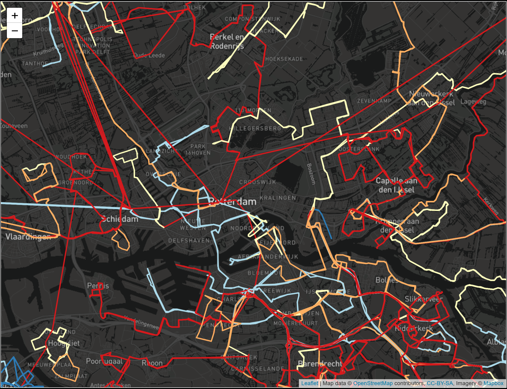
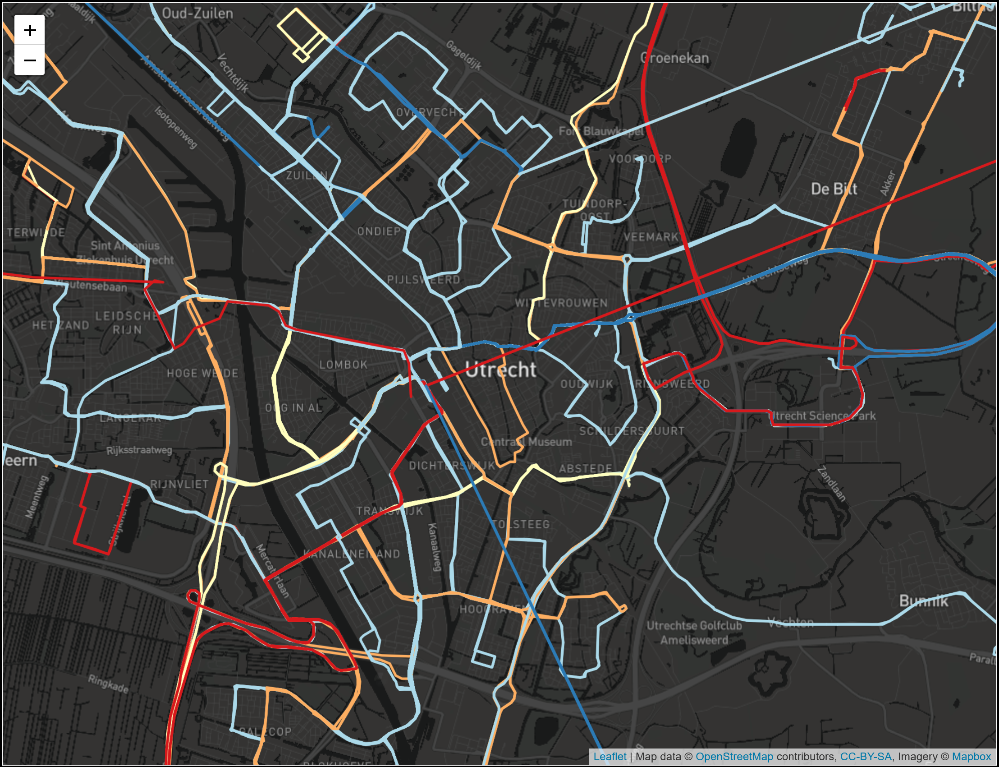

# Welcome to the ROVE Project - Dutch Edition

## What is ROVE?

ROVE is an interactive bus transit performance analysis tool developed by the MIT JTL-Transit Lab. I have made slight modifications to ensure its ability to operate on OV (Dutch) GTFS data. 

The full documentation of ROVE can be found [here](https://rove.readthedocs.io/en/latest/index.html). The original repo can be found [here](https://github.com/jtl-transit/rove).

## Examples:

Below are a few examples of the Dutch bus network visualizations generated by this modified version of ROVE. These visualizations were generated using publicly-available GTFS data during July 2023.

<!--  
 -->

Amsterdam                       |  Rotterdam
:---------------------------------------:|:-------------------------------------------:
  |  

Den Haag (The Hague)                                |  Utrecht
:------------------------------------------------:|:-------------------------------------------:
 |  
